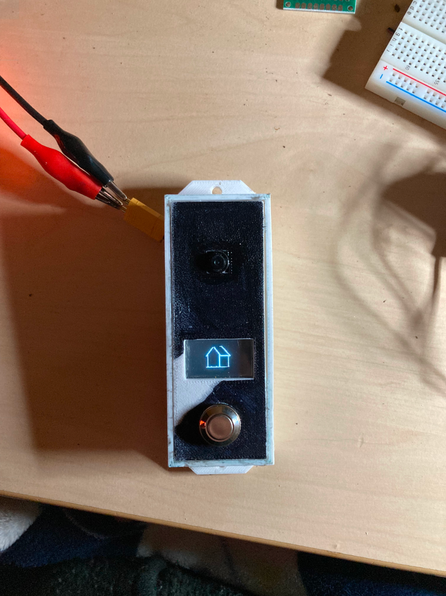

# smartdoorbell
Just another ESP32-cam doorbell with display based on ESPHome

## Used HW
* ESP32-CAM
* SSD1306 0.97" Monochromatic Display 124x64px
* Button (I use old Hoverboard Button)

## PINOUT
### SSD1306 Display
* GPIO15 -> SCL
* GPIO13 -> SDA
* GND & VCC -> ESP32-CAM GND & 3.3V (or 5V if display need)
### Binary Sensor (Button)
* GPIO2 -> +
* GND -> ESP32-CAM GND
